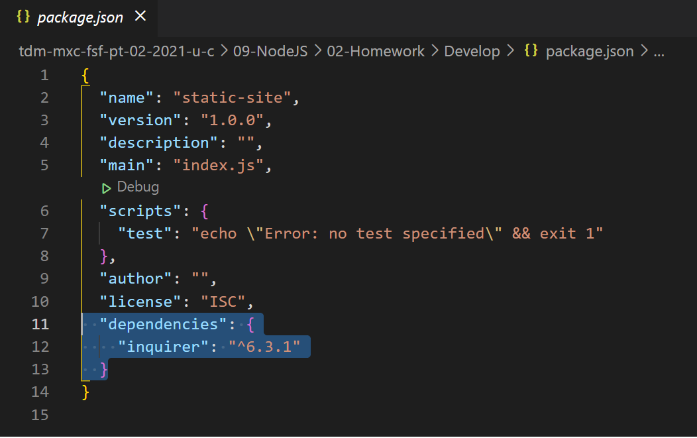

# Readme Generator


## Description
  
  Create a command-line application that dynamically generates a professional README.md file from a user's input using the [Inquirer package](https://www.npmjs.com/package/inquirer).
  
  ## Table of Contents
  
  *[Installation](#installation)
  
  *[Usage](#usage)
  
  *[Build-With](#build-with)

  *[Links](#links)

  *[Author](#author)
  
  *[Contributing](#contributing)
  
  *[Questions](#questions)

  ## Installation
  * Go to the following link [https://github.com/Yazmin30-bot/readme-generator](https://github.com/Yazmin30-bot/readme-generator/) and clone it 
  * Go to Git-bash and page the github's with the following code
    ```
    $ git clone https://github.com/Yazmin30-bot/readme-generator.git 
    ``` 
    
  * When you first set up the project before installing any dependencies, make sure that your repo includes a package.json with the required dependencies. You can create one by running 
    ```
    npm init
  
    ``` 
  * For this project is needed to add the inquirer dependency to package.json file  
    ```
      "dependencies": {
      "inquirer": "^6.3.1"
      }
    ``` 
    

  * To install necessary dependencies, run the following command:
    ```
    npm install
    npm install inquirer
    ```